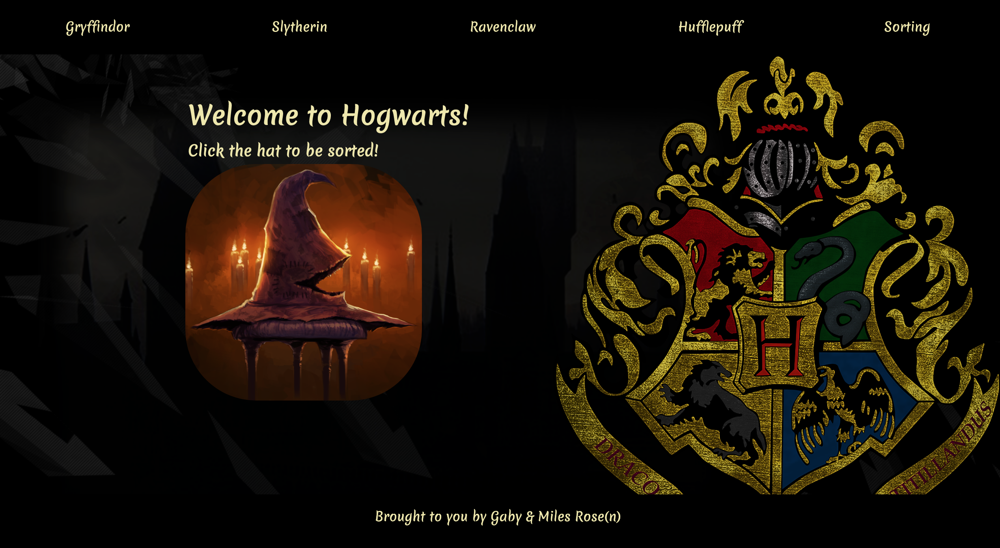
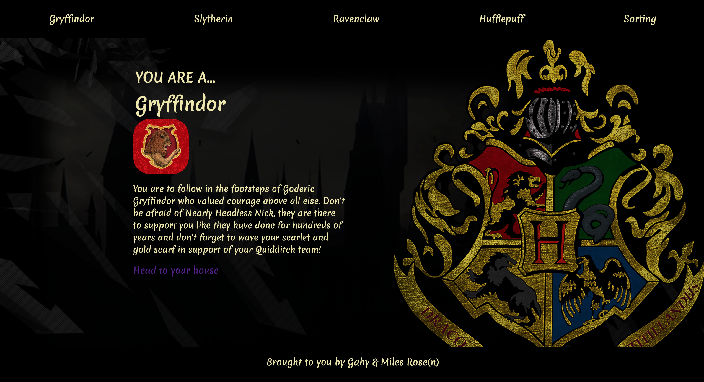
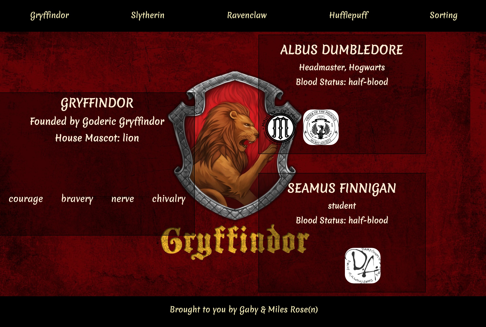

# General Assembly WDI Project 2: An API Reactathon
[The Sorting Hat Link](https://hpapi.herokuapp.com/)

The Sorting Hat was a 2 day project to create an interactive webpage that consumes a public API. This was my first project involving the use of APIs, and did so using JavaScript and React. We created a webpage for Harry Potter fans. Use the sorting hat function to sort into a given house, where you can learn your house traits, details and get a character card of each of your fellow housemates.

---

## Brief

* **Build a React application** that consumes a **public API**.
* **Have several components** - At least one classical and one functional.
* **Include wireframes** - that you designed before building the app.
* Have **semantically clean HTML** - you make sure you write HTML that makes structural sense rather than thinking about how it might look, which is the job of CSS.
* A **git repository hosted on Github**, with a link to your hosted project, and frequent commits dating back to the _very beginning_ of the project
---

## Technologies Used:

* JavaScript
* React
* HTML
* CSS/ SASS
* Webpack
* Yarn
* API connections

## Approach Taken

In a pair we created the Sorting Hat which used www.potterapi.com to pre-populate information pages specific to each Harry Potter house. We pair coded a lot of the initial set up, including creating the webpack and React components. Individually I worked on getting the information for each house and the displaying of the houses. We both worked on the styling using SASS. Throughout the project we communicated on task completions or problems and worked together to solve them.

---

## Screenshot Walk-through

### Homepage


### Once the sorting hat is clicked, your are given a randomised house


### House profile page

___

### Functionality
The user clicks the sorting hat to randomly assign them a house. This redirects to the house homepage including information about and characters in that house.

### Process
Once we decided the theme, we carried out the following to create our webpage, constantly testing through Insomnia.

1. Created a webpack from scratch.
2. Created wireframes for the app.
3. Planning and pseudocoding.
4. Created 4 individual pages to extract the information for each house from the external API using React to create necessary components.
5. Site navigation, header, footer, etc.
6. Styled using SASS.

### Featured code 1

This code shows how we used ```axios.all``` to obtain relevant information from the API in a way that we could use for separate features.

```
componentDidMount() {
  axios.all([
    axios.get(`https://www.potterapi.com/v1/sortingHat?key=${key}`),
    axios.get(`https://www.potterapi.com/v1/houses?key=${key}`)
  ])
    .then(res => {
      const sortedHouse = res[0].data
      console.log(sortedHouse, 'sorted')
      const houseDetails = res[1].data
      this.setState({ sortedHouse, houseDetails })
    })
    .catch(err => console.log(err))
}
```

### Featured code 2

This code shows the display format of each character within the house. By mapping the house character pulled in from the API, we could display information how we wanted. The 'characterGroups' section used a ternary if operation to display an icon if the individual was in the relevant 4 groups or not.

```
<div className="rightSide">
  {houseCharacters.map((houseCharacter, index) => (
    <div key={index} className="characterCard">
      <div className="characterDetails">
        <h2>{houseCharacter.name}</h2>
        <h4>{houseCharacter.role}</h4>
        <h4>Blood Status: {houseCharacter.bloodStatus}</h4>
      </div>
      <div className="characterGroups">
        <div className={`badgeBox ${houseCharacter.ministryOfMagic ? 'mom' : ''}`}> </div>
        <div className={`badgeBox ${houseCharacter.orderOfThePhoenix ? 'otp' : ''}`}></div>
        <div className={`badgeBox ${houseCharacter.dumbledoresArmy ? 'da' : ''}`}></div>
        <div className={`badgeBox ${houseCharacter.deathEater ? 'death' : ''}`}></div>
      </div>
    </div>
  ))}
</div>
```

---

## Wins & Challenges

For me the real win was successfully using a public API and extracting the information that was relevant for our project and rendering onto our page.
this involved learning to pull in the data and sending the information into the DisplayHouse to be displayed on the page.

Challenges included identifying the correct data when using the ```axios all``` command, and how to manipulate the data we stored in this.state.

---

## Future Features
* Implementing a questionnaire to identify which house the user was in rather than a randomiser.

---

## Key Learnings

This was a great chance to develop pair coding skills, and making sure we communicated sufficiently throughout to prevent conflicts within our work, this meant working with Git successfully through this as well. I also learned a lot about using public APIs and the benefit and restraints that come with them. I was pleased with the outcome, given the time restraint and novelty of the process we were working with.
